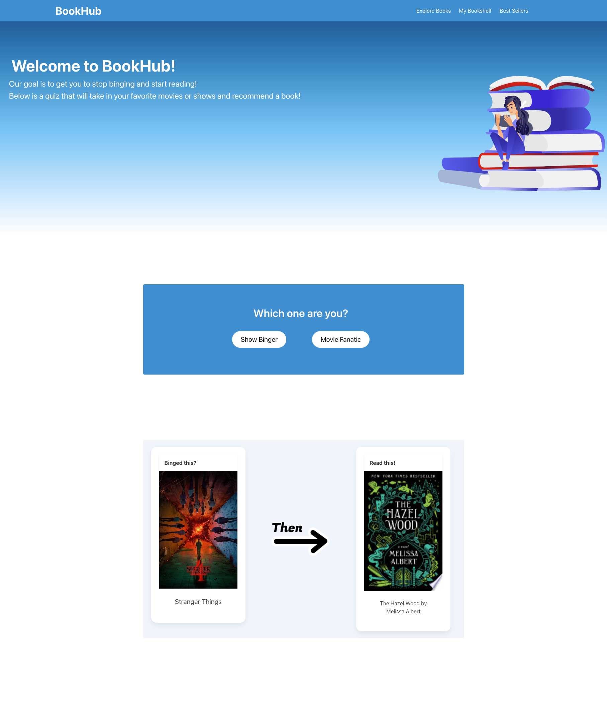
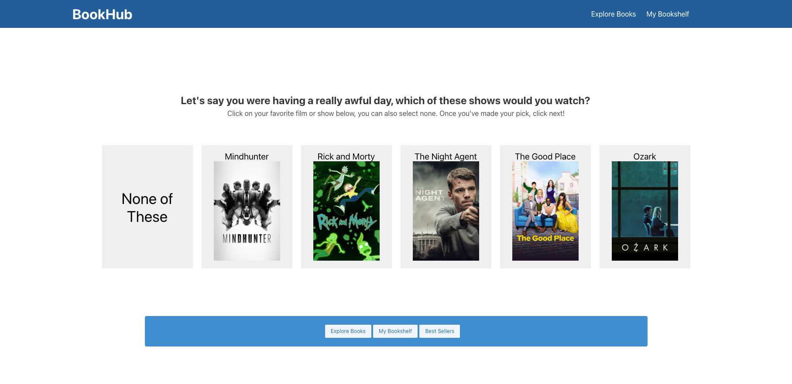
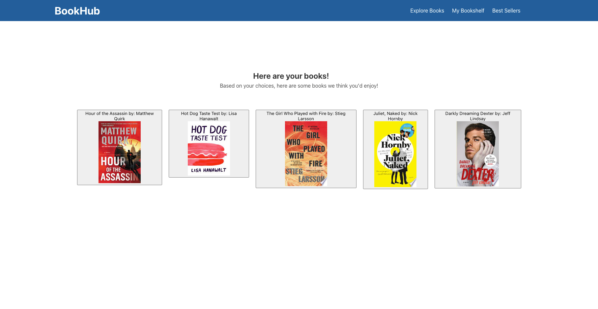

# BookHub

This application is a place for users to take a quiz and get a book recommendation based on their favorite shows.
The user will be presented with a list of shows to choose between and, based on their choices, a list of similar books will be presented. The user will have the option to save the books they're interested in for future reference.

## Deployed Application
You can view the live application
[➡️ here](https://cyphernyx.github.io/javascript-code-quiz/)

## Features

1. Start Button: Clicking the **Show Binger** button will start the quiz.
2. **Questions:** The user is presented with a series of shows to pick from.
3. **Answer Evaluation:** The user's answers are evaluated, and a list of similar books is generated.
4. **Results:** Once the quiz is over, a list of books is presented.
5. **Options** The user has the option to click on a book to see a preview and/or save a book for future reference.

## Usage

- This application can be used to find new books.
- It can be used to save your favorite book.
- Users can share their finds and have friends get book recommendations as well.

## Credits
Colton Siegmund: [GitHub](https://github.com/ColtonSiegmund)

Dahlia Guido: [GitHub](https://github.com/CypherNyx)

Annie McElroy: [GitHub](https://github.com/Annie-McElroy)

AnaCristina Segovia: [GitHub](https://github.com/Aseg02)

### Sites we used to collect book recommendations:

[The Line Up](https://the-line-up.com/15-books-for-fans-of-american-horror-story)

[Thriller Fix](https://thrillerfix.com/thrillerpicks-action/books-for-jack-ryan-fans/)

[GoodReads](https://www.goodreads.com/topic/show/21253360-what-are-books-similar-to-the-tv-show-lost)

## APIs
TMDB: [Docs](https://developer.themoviedb.org/docs/getting-started)

Google Books: [Docs](https://developers.google.com/books)

## Technologies Used

